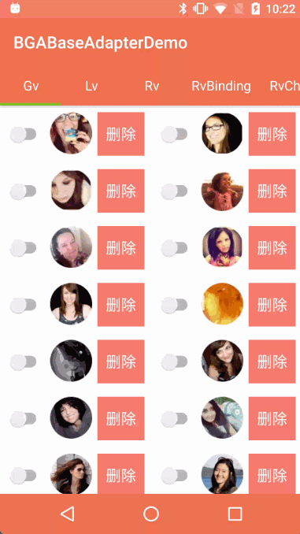
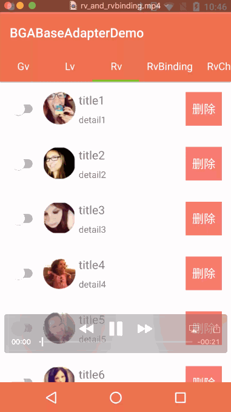
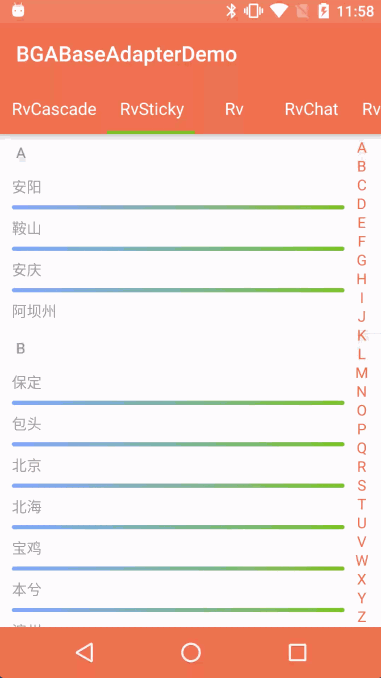

:running:BGABaseAdapter-Android:running:
============

[](https://www.apache.org/licenses/LICENSE-2.0)
[](https://central.sonatype.com/artifact/cn.bingoogolapple/bga-baseadapter)

## 目录
* [功能介绍](#功能介绍)
* [效果图与示例 apk](#效果图与示例-apk)
* [使用](#使用)
* [感谢](#感谢)
* [关于我](#关于我)
* [打赏支持](#打赏支持)

## 功能介绍
在 AdapterView 和 RecyclerView 中通用的 Adapter 和 ViewHolder。

- [x] BGAAdapterViewAdapter 和 BGAViewHolderHelper 用于简化 AdapterView 的子类（如 ListView、GridView）的适配器的编写
- [x] BGARecyclerViewAdapter 和 BGAViewHolderHelper 用于简化 RecyclerView 的适配器的编写，支持多 Item 类型，支持添加多个 Header 和 Footer，回调接口里的索引位置已经在库里处理了，不需要开发者自己减去 Header 个数
- [x] BGADivider 用于简化 RecyclerView 分割线的编写，以及轻松实现基于 RecyclerView 的吸顶悬浮分类索引
- [x] BGABindingRecyclerViewAdapter 和 BGABindingViewHolder 用于 RecyclerView 结合 DataBinding 使用时简化 RecyclerView 的适配器的编写，支持多 Item 类型，支持添加多个 Header 和 Footer，回调接口里的索引位置已经在库里处理了，不需要开发者自己减去 Header 个数
- [x] BGARVVerticalScrollHelper 用于将 RecyclerView 滚动到指定位置

## 效果图与示例 apk

| 简化 GridView/ListView 适配器 | RecyclerView/Header/Footer/拖拽排序 |
| ------------ | ------------- |
|  |   |

| RecyclerView 多 ItemType | 吸顶分类索引 |
| ------------ | ------------- |
|  |   |

| 仿美团外卖点餐界面左右联动 |
| ------------ |
|  |


[点击下载 BGABaseAdapterDemo.apk](http://fir.im/BGABaseAdapterDemo) 或扫描下面的二维码安装


## 使用

### Gradle 依赖

> 该库已迁移到 AndroidX（minSdk 21），使用方工程需开启 AndroidX（`android.useAndroidX=true`）

```groovy
implementation 'cn.bingoogolapple:bga-adapter:latestVersion'
```

### 简化 AdapterView 的子类（如 ListView、GridView）的适配器的编写

[AdapterViewAdapter.java](https://github.com/bingoogolapple/BGABaseAdapter-Android/tree/master/demo/src/main/java/cn/bingoogolapple/baseadapter/demo/adapter/AdapterViewAdapter.java)

### 简化 RecyclerView 的适配器的编写

[RvAdapter.java](https://github.com/bingoogolapple/BGABaseAdapter-Android/tree/master/demo/src/main/java/cn/bingoogolapple/baseadapter/demo/adapter/RvAdapter.java)

### RecyclerView 结合 DataBinding 使用时简化 RecyclerView 的适配器的编写

[RvBindingFragment.java](https://github.com/bingoogolapple/BGABaseAdapter-Android/tree/master/demo/src/main/java/cn/bingoogolapple/baseadapter/demo/ui/fragment/RvBindingFragment.java)

### BGADivider 用于简化 RecyclerView 分割线的编写，以及轻松实现基于 RecyclerView 的悬浮分类索引

[RvStickyFragment.java](https://github.com/bingoogolapple/BGABaseAdapter-Android/tree/master/demo/src/main/java/cn/bingoogolapple/baseadapter/demo/ui/fragment/RvStickyFragment.java)

### 仿美团外卖点餐界面左右联动

[RvCascadeFragment.java](https://github.com/bingoogolapple/BGABaseAdapter-Android/tree/master/demo/src/main/java/cn/bingoogolapple/baseadapter/demo/ui/fragment/RvCascadeFragment.java)

### 代码是最好的老师，详细用法请查看 [demo](https://github.com/bingoogolapple/BGABaseAdapter-Android/tree/master/demo):feet:

## 感谢

* [https://github.com/hongyangAndroid/baseAdapter](https://github.com/hongyangAndroid/baseAdapter)
参考该库的为 RecyclerView 添加 Header 和 Footer
* [https://github.com/iPaulPro/Android-ItemTouchHelper-Demo](https://github.com/iPaulPro/Android-ItemTouchHelper-Demo)
参考该库的拖拽排序功能

## 作者联系方式

| 个人主页 | 邮箱 |
| ------------- | ------------ |
| <a  href="https://www.bingoogolapple.cn" target="_blank">bingoogolapple.cn</a>  | <a href="mailto:bingoogolapple@gmail.com" target="_blank">bingoogolapple@gmail.com</a> |

| 个人微信号 | 微信群 | 公众号 |
| ------------ | ------------ | ------------ |
|  |  |  |

| 个人 QQ 号 | QQ 群 |
| ------------ | ------------ |
|  |  |

## 打赏支持作者

如果您觉得 BGA 系列开源库或工具软件帮您节省了大量的开发时间，可以扫描下方的二维码打赏支持。您的支持将鼓励我继续创作，打赏后还可以加我微信免费开通一年 [上帝小助手浏览器扩展/插件开发平台](https://github.com/bingoogolapple/bga-god-assistant-config) 的会员服务

| 微信 | QQ | 支付宝 |
| ------------- | ------------- | ------------- |
|  |  |  |

## 作者项目推荐

* 欢迎您使用我开发的第一个独立开发软件产品 [上帝小助手浏览器扩展/插件开发平台](https://github.com/bingoogolapple/bga-god-assistant-config)

## License

    Copyright 2015 bingoogolapple

    Licensed under the Apache License, Version 2.0 (the "License");
    you may not use this file except in compliance with the License.
    You may obtain a copy of the License at

       http://www.apache.org/licenses/LICENSE-2.0

    Unless required by applicable law or agreed to in writing, software
    distributed under the License is distributed on an "AS IS" BASIS,
    WITHOUT WARRANTIES OR CONDITIONS OF ANY KIND, either express or implied.
    See the License for the specific language governing permissions and
    limitations under the License.
