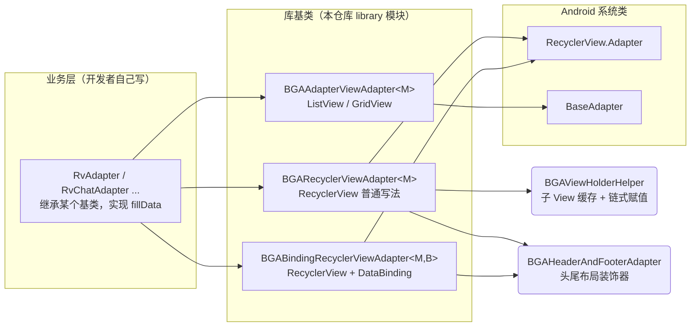
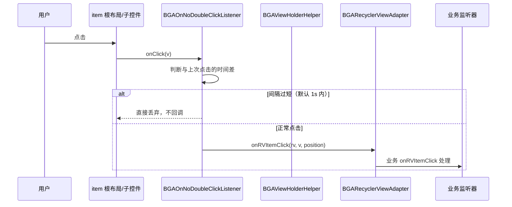
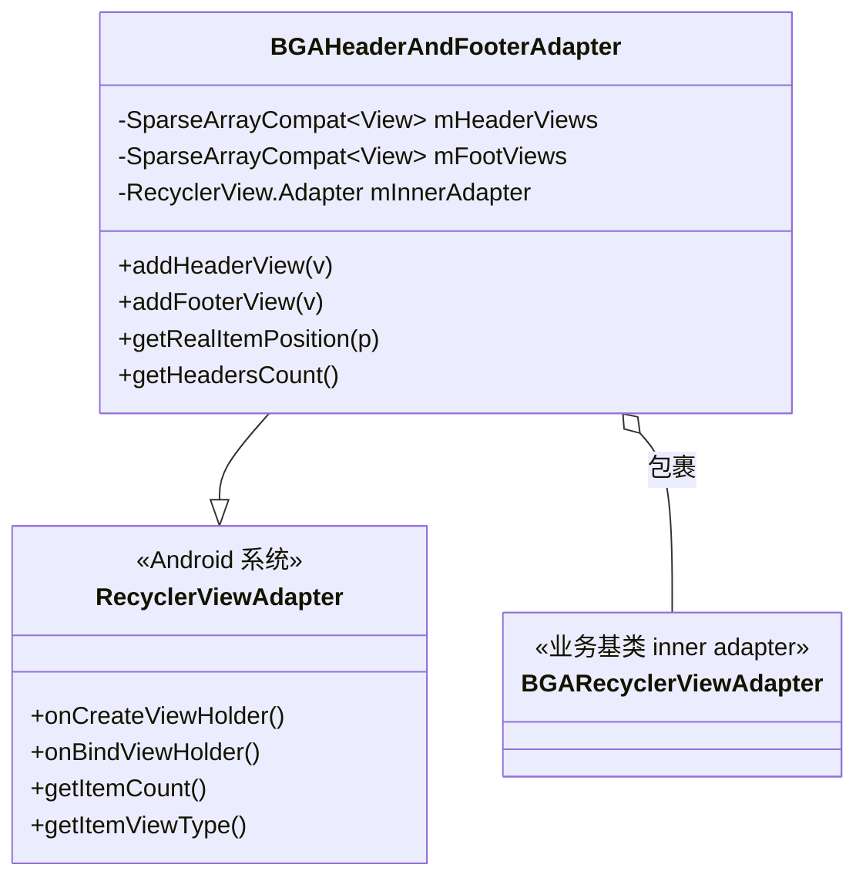
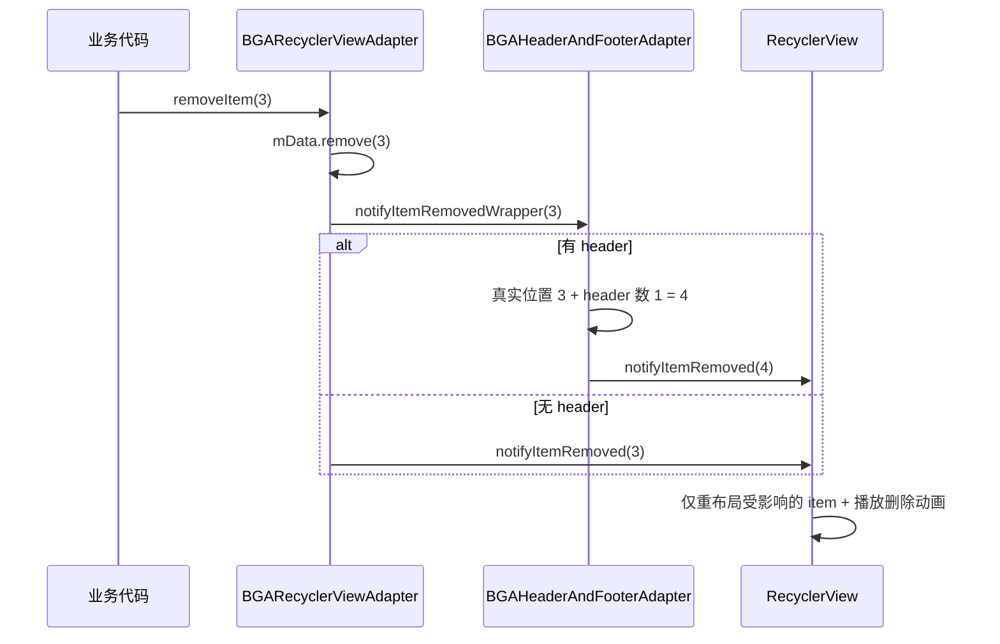
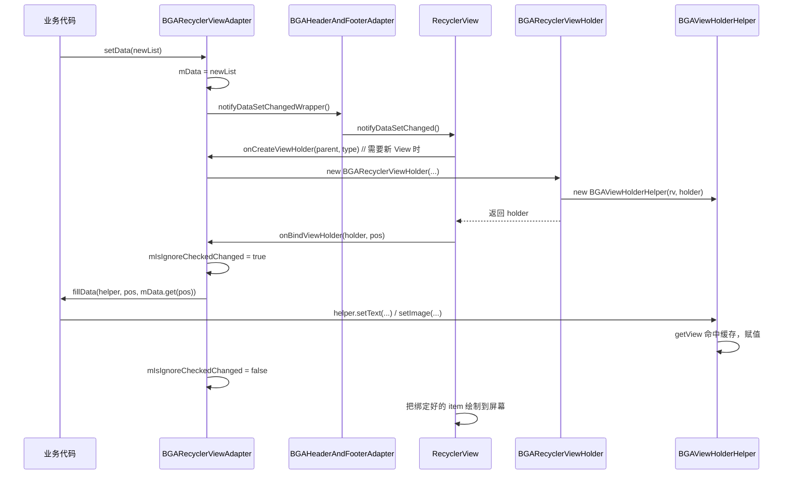

# BGAAdapter 实现原理

> 面向刚接触 Android 列表开发的同学，用最直白的方式讲清楚这个库「怎么用、为什么这么设计、底层原理是什么」。
> 读完后你应当能在自己的项目里照着同样的思路，写出可复用的列表适配器，或者看懂其它类似框架（如 BaseRecyclerViewAdapterHelper）。

---

## 一、这个库解决了什么问题

在 Android 里，不管是 `ListView`/`GridView`（统称为 **AdapterView**）还是 `RecyclerView`，展示一个列表都要写「适配器（Adapter）」。原生写法有几个让人头疼的地方：

1. **样板代码极多**：每次都要手写 `ViewHolder`、在 `getView`/`onBindViewHolder` 里反复 `findViewById`、重复写 `setText`/`setImage` 等。
2. **事件监听很零散**：item 点击、item 长按、item 里某个按钮点击、某个 CheckBox 勾选变化……每种都要自己接一遍。
3. **增删改数据要手动调一堆 `notify`**：而且容易调错（比如漏调、调了全量刷新导致卡顿）。
4. **加头布局/尾布局很麻烦**：`RecyclerView` 原生不支持，得自己在 `getItemViewType`/`getItemCount` 里自己算偏移。

BGAAdapter 把这些共性逻辑全部抽到基类里，业务侧只需要关心「**这一条数据怎么填到布局上**」这一件事。

### 使用前后对比

原生 `RecyclerView` 写法（简化）：

```java
// 每次都要手写 ViewHolder、缓存控件、在 onBind 里逐个赋值
class NormalAdapter extends RecyclerView.Adapter<NormalAdapter.VH> {
    List<NormalModel> mData;
    public NormalAdapter.ViewHolder onCreateViewHolder(...) { ... }
    public void onBindViewHolder(VH h, int p) {
        h.title.setText(mData.get(p).title);   // 重复 findViewById 的变体
        h.detail.setText(mData.get(p).detail);
    }
}
```

用 BGAAdapter 之后的业务代码（来自 demo 的 `RvAdapter`）：

```java
public class RvAdapter extends BGARecyclerViewAdapter<NormalModel> {
    public RvAdapter(RecyclerView recyclerView) {
        super(recyclerView, R.layout.item_normal);   // 一句指定布局
    }
    @Override
    public void fillData(BGAViewHolderHelper helper, int position, NormalModel model) {
        helper.setText(R.id.tv_item_normal_title, model.title)
              .setText(R.id.tv_item_normal_detail, model.detail);  // 链式调用
    }
}
```

**你只需要做两件事**：指定布局 + 实现 `fillData`。其余的复用、缓存、刷新、监听全部由基类搞定。

---

## 二、整体架构：三种适配器 + 三层结构

库按「展示控件类型」和「是否使用 DataBinding」提供了三套基类，业务侧按需继承其一：



### 三层职责划分

| 层级 | 代表类 | 职责 |
|------|--------|------|
| **Adapter 层** | `BGARecyclerViewAdapter` 等 | 管理数据集合 `mData`、决定创建哪种 item、在绑定数据时回调 `fillData`、提供增删改的 `notify` 方法 |
| **ViewHolder 层** | `BGARecyclerViewHolder` / `BGAAdapterViewHolder` / `BGABindingViewHolder` | 持有一条 item 的根布局，把「根布局」和「helper」绑在一起，处理 item 级点击/长按 |
| **Helper 层** | `BGAViewHolderHelper` | 缓存子控件、提供 `setText`/`setImage` 等链式 API、桥接子控件事件到业务监听器 |

> **设计思想**：把「变化的部分」（怎么把 model 填进布局）留给子类用抽象方法 `fillData` 实现，把「不变的部分」（复用、缓存、刷新、监听分发）封进基类。这正是 **模板方法模式（Template Method）**。

---

## 三、核心机制逐个拆解

### 1. ViewHolder 复用机制（列表性能的根基）

这是 Android 列表最核心的性能原理，也是理解整个库的前提。

#### AdapterView（ListView/GridView）的复用

系统只会传给你一个 `convertView`（滚出屏幕的旧 item 视图），你需要自己把它存起来复用。BGAAdapter 用「`setTag` 存 ViewHolder，`getTag` 取 ViewHolder」实现手动复用：

```java
// BGAAdapterViewHolder.dequeueReusableAdapterViewHolder
public static BGAAdapterViewHolder dequeueReusableAdapterViewHolder(View convertView, ViewGroup parent, int layoutId) {
    if (convertView == null) {
        return new BGAAdapterViewHolder(parent, layoutId);  // 第一次：inflate 新布局
    }
    return (BGAAdapterViewHolder) convertView.getTag();     // 之后：直接取缓存的 ViewHolder
}
```

构造时把 ViewHolder 绑到视图上：`mConvertView.setTag(this)`。这样每次 `getView` 拿到的都是「已经持有子控件引用」的 ViewHolder，不用重新 `findViewById`。

#### RecyclerView 的复用

`RecyclerView` 把复用做进了系统框架：**`onCreateViewHolder` 只在创建新 View 时调用一次，`onBindViewHolder` 在每次绑定数据时调用**。库里的实现：

```java
// BGARecyclerViewAdapter.onCreateViewHolder
BGARecyclerViewHolder viewHolder = new BGARecyclerViewHolder(this, mRecyclerView,
        LayoutInflater.from(mContext).inflate(viewType, parent, false), ...);
```

> **原理重点**：为什么 RecyclerView 比 ListView 性能更好？
> - ListView 只有一层 `convertView` 复用池；
> - RecyclerView 多了 **`RecyclerViewPool`**（按 itemType 分类的复用池，可跨 `RecyclerView` 共享）、`Cache`（刚滑出屏幕的 item，position 稳定可直接复用不重绑）、`StableId` 等机制；
> - 所以 RecyclerView 在大列表、多类型 item 场景下复用率更高，滚动更流畅。

#### 关键区别总结

| | AdapterView（ListView） | RecyclerView |
|---|---|---|
| 复用触发 | `getView(convertView)` 自己判断 | 框架自动：`onCreateViewHolder` / `onBindViewHolder` |
| ViewHolder | 需手动 `setTag`/`getTag` | 强制要求 ViewHolder |
| 局部刷新 | 只有 `notifyDataSetChanged` | 丰富的 `notifyItemChanged/Inserted/Removed/Moved` |
| 布局管理 | 固定 | 可换 `LayoutManager`（线性/网格/瀑布流） |

---

### 2. BGAViewHolderHelper：子 View 缓存 + 链式赋值

每次绑定都要 `findViewById` 吗？不用。`BGAViewHolderHelper` 用一个 `SparseArrayCompat<View>` 把「控件 id → 控件对象」缓存起来：

```java
// BGAViewHolderHelper.getView
public <T extends View> T getView(@IdRes int viewId) {
    View view = mViews.get(viewId);          // 先查缓存
    if (view == null) {
        view = mConvertView.findViewById(viewId);  // 没有才真的去树里找
        mViews.put(viewId, view);                  // 放进缓存
    }
    return (T) view;
}
```

> **原理重点**：`findViewById` 是从根 View 开始**递归遍历整棵 View 树**查找（时间复杂度 O(n)，n 是该 item 的控件数量）。一条 item 里有七八个控件、屏幕上一屏十几个 item、快速滚动时 `onBindViewHolder` 会被高频调用，如果每帧都全树查找会非常浪费。缓存一次后直接 O(1) 命中。

**为什么用 `SparseArrayCompat` 而不是 `HashMap<Integer, View>`？** `SparseArrayCompat` 是 Android 专为「int 键」优化的容器：避免了 `Integer` 的**自动装箱/拆箱**，且内部用两个平行数组存储、内存更紧凑。这是 Android 性能优化的一个经典细节。

赋值 API 用「返回 `this`」实现链式调用：

```java
helper.setText(R.id.title, model.title)
      .setText(R.id.detail, model.detail)
      .setImageResource(R.id.icon, R.drawable.xxx)
      .setChecked(R.id.cb, model.selected);
```

每个方法内部都是 `getView(viewId)` → 强转 → 调原生 setter，然后 `return this`。

---

### 3. 模板方法模式：`fillData` 钩子

基类把「数据绑定」这个一定会变化的行为抽成抽象方法，子类必须实现：

```java
// BGARecyclerViewAdapter
protected abstract void fillData(BGAViewHolderHelper helper, int position, M model);
```

调用点固定在 `onBindViewHolder` 里：

```java
@Override
public void onBindViewHolder(BGARecyclerViewHolder viewHolder, int position) {
    mIsIgnoreCheckedChanged = true;        // 开始绑定，屏蔽 checked 回调（见第 8 节）
    fillData(viewHolder.getViewHolderHelper(), position, getItem(position));
    mIsIgnoreCheckedChanged = false;       // 绑定结束
}
```

子类只写「业务数据 → 控件」的映射，不用关心复用、刷新这些杂事。

---

### 4. 多层事件监听与 position 归一化（重点）

库提供 6 种监听器，覆盖列表能想到的所有交互：

| 监听器 | 触发时机 |
|--------|----------|
| `BGAOnRVItemClickListener` | 点击整条 item |
| `BGAOnRVItemLongClickListener` | 长按整条 item |
| `BGAOnItemChildClickListener` | 点击 item 里的某个子控件（如删除按钮） |
| `BGAOnItemChildLongClickListener` | 长按 item 里的子控件 |
| `BGAOnItemChildCheckedChangeListener` | item 里 CheckBox/RadioButton 状态变化 |
| `BGAOnRVItemChildTouchListener` | item 里子控件的触摸事件 |

#### 事件是怎么串起来的



item 整体点击在 `BGARecyclerViewHolder` 构造时接好；子控件点击在业务子类重写 `setItemChildListener` 时，由 helper 代为 `setItemChildClickListener(viewId)` 挂上。

#### position 归一化：为什么要 `getAdapterPositionWrapper`

这是**最容易出 bug 也最值得讲清楚**的点。

当列表加了 header / footer 后，`RecyclerView` 给 `onBindViewHolder` 的 `position`（叫 **adapterPosition**）是「包含 header/footer 在内的总位置」。但业务数据 `mData` 的索引是从 0 开始的真实数据位置。两者差了一个「header 数量」的偏移。

```java
// BGARecyclerViewHolder.getAdapterPositionWrapper
public int getAdapterPositionWrapper() {
    if (mRecyclerViewAdapter.getHeadersCount() > 0) {
        return getAdapterPosition() - mRecyclerViewAdapter.getHeadersCount(); // 减去 header 偏移
    }
    return getAdapterPosition();
}
```

点击事件回调给业务前，库统一用这个「归一化位置」：

```java
// 点击 item 时
mOnRVItemClickListener.onRVItemClick(mRecyclerView, v, getAdapterPositionWrapper());
```

> **原理重点**：
> - `getAdapterPosition()` 是 `RecyclerView.ViewHolder` 自带方法，返回 item 在 **当前 adapter（含 header/footer）** 中的位置。**注意它可能为 `NO_POSITION(-1)`**（item 刚被移除、正在做动画时调用），所以真实业务代码里取位置要判空。
> - 如果不做这层偏移换算，点了第 3 条数据却拿到了第 4 条（header 占了一位），数据就串行了。库把这件事封装好，业务方拿到的永远是「真实数据索引」。

---

### 5. 装饰器模式：Header / Footer 怎么加（重点）

`RecyclerView` 原生不支持头尾布局。BGAAdapter 用 **装饰器模式**（Wrapper）解决：再包一层 `Adapter`，由它统一管理 header/footer，把真实 item 的活「转交」给内层 adapter。



#### 三个核心换算逻辑

**① itemType 映射**：header/footer 用特殊的 type 值（2048、4096 起），真实 item 直接透传内层 adapter 的 type。

```java
@Override
public int getItemViewType(int position) {
    if (isHeaderView(position))       return mHeaderViews.keyAt(position);
    if (isFooterView(position))       return mFootViews.keyAt(position - getHeadersCount() - getRealItemCount());
    return mInnerAdapter.getItemViewType(getRealItemPosition(position));  // 真实 item：减去 header 偏移
}
```

**② 数量 = header + 真实 + footer**：

```java
@Override
public int getItemCount() {
    return getHeadersCount() + getFootersCount() + getRealItemCount();
}
```

**③ 绑定分流**：header/footer 不需要绑数据，直接 return；真实 item 把位置换算后转交给内层 adapter：

```java
@Override
public void onBindViewHolder(RecyclerView.ViewHolder holder, int position) {
    if (isHeaderViewOrFooterView(position)) return;          // 头尾不绑数据
    mInnerAdapter.onBindViewHolder(holder, getRealItemPosition(position));
}
```

#### 额外处理：GridLayoutManager 下头尾占满整行

如果用网格布局，header/footer 应该横跨所有列。库在 `onAttachedToRecyclerView` 里重写 `SpanSizeLookup`：

```java
gridLayoutManager.setSpanSizeLookup(new GridLayoutManager.SpanSizeLookup() {
    @Override
    public int getSpanSize(int position) {
        if (isHeaderViewOrFooterView(position)) return gridLayoutManager.getSpanCount(); // 占满
        return 1; // 普通 item 占 1 格
    }
});
```

瀑布流（`StaggeredGridLayoutManager`）则在 `onViewAttachedToWindow` 里给 header/footer 设 `setFullSpan(true)`。

> **原理重点**：这种「包一层、转发调用、做位置换算」的思路就是**装饰器模式**，也是 `RecyclerView` 官方 `ConcatAdapter`、`ListItemAdapter` 等组件的设计思想。理解它，你就能给任何 adapter「加功能」而不改动原类——比如再包一层做「加载更多」「分组」。

---

### 6. 局部刷新与 Wrapper 通知（重点，性能关键）

库提供了一整套增删改数据的方法：`setData` / `addNewData`（头部插入，如下拉刷新）/ `addMoreData`（尾部追加，如上拉加载）/ `removeItem` / `addItem` / `setItem` / `moveItem`。

**关键设计**：所有方法在调用系统的 `notifyItemXxx` 之前，都会先偏移到「包含 header 的真实 adapter 位置」，这就是一堆带 `Wrapper` 后缀的方法：

```java
public final void notifyItemInsertedWrapper(int position) {
    if (mHeaderAndFooterAdapter == null) {
        notifyItemInserted(position);
    } else {
        // 真实位置 + header 数量 = 在装饰器 adapter 里的位置
        mHeaderAndFooterAdapter.notifyItemInserted(mHeaderAndFooterAdapter.getHeadersCount() + position);
    }
}
```

> **原理重点：为什么不用 `notifyDataSetChanged()` 一把梭？**
> - `notifyDataSetChanged()` 会让 RecyclerView **重新绑定屏幕上所有可见 item**，列表长时明显卡顿，且**没有进入/退出的动画**。
> - `notifyItemInserted/Removed/Changed/Moved` 是**局部刷新**：只处理变化的那一条，配合 `DefaultItemAnimator` 自动播放增删移动画，性能友好。
> - 现代写法还可以用 `DiffUtil` / `ListAdapter` 自动算出「哪几条变了」再局部刷新（本库手写 `Wrapper` 做了等效的位置换算）。记住一条原则：**能局部刷新就别全量刷新**。

#### 删除/移动的完整时序



---

### 7. 防抖点击：BGAOnNoDoubleClickListener（原理）

快速连点可能触发重复请求/重复提交。库用「**时间差节流**」解决：

```java
public abstract class BGAOnNoDoubleClickListener implements View.OnClickListener {
    private int mThrottleFirstTime = 1000; // 默认 1 秒内只响应一次
    private long mLastClickTime = 0;

    @Override
    public void onClick(View v) {
        long currentTime = System.currentTimeMillis();
        if (currentTime - mLastClickTime > mThrottleFirstTime) { // 距离上次超过阈值才响应
            mLastClickTime = currentTime;
            onNoDoubleClick(v);   // 业务只需实现这个
        }
    }
}
```

> **原理重点**：这是客户端最常见的「防抖/节流」实现之一。它把「是否允许响应」的判断收口在一个地方，业务方继承后只写 `onNoDoubleClick`，既防了连点又不必每处都自己记时间戳。类似的思路在按钮防重复提交、搜索框输入节流里随处可见。

---

### 8. mIsIgnoreCheckedChanged 标志位（重点，一个经典坑）

看 `onBindViewHolder` 开头和结尾：

```java
mIsIgnoreCheckedChanged = true;
fillData(...);                 // 里面会调 helper.setChecked(...)
mIsIgnoreCheckedChanged = false;
```

为什么需要它？在 `fillData` 里给 CheckBox 调 `setChecked(state)` 时，**CheckBox 会反过来触发 `OnCheckedChangeListener`**。如果此时业务监听器正监听勾选变化去改数据/发请求，就会导致「我只是刷新列表把状态填进去，却意外触发了勾选回调」的连锁 bug。

`BGAViewHolderHelper` 在回调里专门判断了这个标志：

```java
@Override
public void onCheckedChanged(CompoundButton buttonView, boolean isChecked) {
    ...
    if (!recyclerViewAdapter.isIgnoreCheckedChanged()) {   // 只有在「非回填」阶段才回调业务
        mOnItemChildCheckedChangeListener.onItemChildCheckedChanged(...);
    }
}
```

> **原理重点**：这本质上是**「数据回填（赋值）」和「用户操作（事件）」的方向区分**，是观察者/回调模式里一个非常经典的陷阱——**「程序设值」不应触发「用户变更」的监听**。很多框架（如 EditText 的 `TextWatcher`、LiveData 回设）都有类似处理方式。记住：给控件赋值时如果会触发它的监听，要想办法屏蔽这次自动回调。

---

### 9. DataBinding 支持：BGABindingRecyclerViewAdapter

如果你的 item 布局用了 DataBinding（`layout` 根标签 + `<data>` 变量），就用这套基类。它的 `onBindViewHolder` 不走 `fillData`，而是把变量「注射」进 binding：

```java
// BGABindingRecyclerViewAdapter.onBindViewHolder
B binding = viewHolder.getBinding();
binding.setLifecycleOwner(mLifecycleOwner);
binding.setVariable(BR.viewHolder, viewHolder);  // 把 holder 暴露给布局
binding.setVariable(BR.uiHandler, mUiHandler);   // item 点击事件处理器
binding.setVariable(BR.statusModel, mStatusModel);
binding.setVariable(BR.model, model);           // 当前这条数据
bindSpecialModel(binding, position, model);     // 子类可追加特殊绑定
binding.executePendingBindings();               // 立即执行绑定，避免闪烁
```

布局里就能直接用这些变量，例如 `android:onClick="@{uiHandler::onItemClick}"`、`android:text="@{model.title}"`。

> **原理重点**：
> - `BR` 类是 DataBinding 编译期生成的「变量索引表」，类似 `R.java`。
> - `executePendingBindings()` 很关键：DataBinding 默认把绑定**延迟到下一帧**执行以批量处理；但在 `onBindViewHolder` 里必须**立即执行**，否则因为 ViewHolder 复用，会出现「新数据没刷新、显示了上一屏旧数据」的闪烁问题。
> - `setLifecycleOwner` 让布局里的 `LiveData` 能感知生命周期自动更新。

---

### 10. 其他辅助组件

| 类 | 作用 | 原理一句话 |
|----|------|-----------|
| `BGAEmptyView` | 空数据/加载失败占位 | 一个 `FrameLayout`，内置内容视图 + 空视图，根据数据状态切换 `VISIBLE/GONE` |
| `BGADivider` | RecyclerView 分隔线 | 继承 `RecyclerView.ItemDecoration`，在 `onDraw` 里按方向/边距/跳过数量绘制分割线 |
| `BGARVVerticalScrollHelper` | 平滑滚动到指定位置 | 监听滚动状态，区分「已经在屏内（scrollBy 微调）/屏外（smoothScrollToPosition）」，处理分类悬浮偏移 |
| `BGABaseAdapterUtil` | 工具类（dp2px、取 Application 等） | 通过反射 `AppGlobals`/`ActivityThread` 拿全局 `Application`，避免到处传 `Context` |
| `BGAOnNoDoubleClickListener` | 防连点 | 见第 7 节 |

---

## 四、完整数据流：从 setData 到屏幕渲染

把前面几节串成一条线，理解一次「刷新数据」到底发生了什么：



---

## 五、设计思想总结与举一反三

读到这里，你已经掌握了这个库的全部骨架。把它抽象成几个可复用的思想，就能迁移到任何列表/适配器场景：

1. **模板方法模式**：把「不变的流程」放基类，「变化的点」用抽象方法/钩子留给子类。除了 adapter，Activity 基类、网络请求封装都常用这招。
2. **复用 + 缓存**：ViewHolder 解决「View 对象复用」，`SparseArrayCompat` 解决「子控件查找复用」。凡是「高频创建/查找」的对象，都可以考虑缓存一层。
3. **装饰器模式**：不改变原类，包一层加功能（头尾布局、加载更多、分组）。比继承更灵活，是 RecyclerView 官方也推崇的扩展方式。
4. **position 偏移意识**：凡是「外层包了一层、加了一层偏移」的场景，回调给业务前都要做位置换算，否则数据串行。这个坑在嵌套列表、分组列表里尤其常见。
5. **局部刷新优于全量刷新**：性能优化的一条铁律，既流畅又有动画。
6. **区分「设值」与「事件」**：程序回填数据时要屏蔽自动触发的回调，避免连锁 bug。
7. **防抖**：高频交互（点击、输入）都该考虑节流，避免重复请求。

> 把以上 7 点吃透，你不仅能用好 BGAAdapter，也能轻松看懂 BaseRecyclerViewAdapterHelper、BRVAH、以及 Jetpack 的 `ListAdapter`+`DiffUtil`，甚至能自己动手搭一套适合团队的列表框架。

---

## 附：面试高频考点速记

> 下面把本文的核心原理压缩成「能背、能对」的速记卡片，适合在复习列表/适配器相关知识点时自测。

### 速记口诀

| 主题 | 口诀 | 对应原理 |
|------|------|----------|
| **ViewHolder 复用** | 「ListView 手动存 Tag，RecyclerView 框架自动创」 | AdapterView 靠 `setTag/getTag` 复用；RecyclerView 的 `onCreateViewHolder` 只建一次、`onBindViewHolder` 反复绑 |
| **子控件缓存** | 「findViewById 遍历树，SparseArray 一次存」 | `BGAViewHolderHelper` 用 `SparseArrayCompat<View>` 缓存，避免每次全树查找；int 键省去自动装箱 |
| **模板方法** | 「流程基类定，填充子类写」 | 基类管复用/刷新/监听，`fillData` 抽象方法交给业务填数据 |
| **position 偏移** | 「有头先减头，回调才不串」 | header/footer 导致 adapterPosition ≠ 数据索引，用 `getAdapterPositionWrapper()` 减 header 数 |
| **装饰器加头尾** | 「包一层转调用，类型数量各自算」 | `BGAHeaderAndFooterAdapter` 包裹内层 adapter，重算 itemType/数量/绑定位置 |
| **刷新方式** | 「能局部别全量，动画流畅不卡」 | `notifyItemXxx` 局部刷新优于 `notifyDataSetChanged` 全量重绑 |
| **防抖** | 「时间差一秒，连点只响应」 | `BGAOnNoDoubleClickListener` 用 `currentTime - mLastClickTime > 阈值` 节流 |
| **回填陷阱** | 「设值先关门，事件不误触」 | 绑数据前 `mIsIgnoreCheckedChanged = true`，屏蔽 CheckBox `setChecked` 引发的自动回调 |
| **DataBinding** | 「变量注射进，绑定立即行」 | `setVariable(BR.model,…)` 注射数据，`executePendingBindings()` 防复用闪烁 |

### 高频问答（自测）

**Q1：RecyclerView 为什么比 ListView 性能更好？**
A：ListView 只有单层 `convertView` 复用池；RecyclerView 多了 `RecyclerViewPool`（按 itemType 分类、可跨列表共享）、`Cache`（刚滑出、position 稳定的 item 直接复用不重绑），且把布局计算交给可替换的 `LayoutManager`，复用率更高、滚动更顺。

**Q2：`findViewById` 为什么要缓存？`SparseArrayCompat` 比 `HashMap` 好在哪？**
A：`findViewById` 从根 View 递归遍历整棵 View 树（O(n)），列表快速滚动时高频调用很浪费。`getView()` 第一次查找后存入 `SparseArrayCompat`，之后 O(1) 命中。`SparseArrayCompat` 是 Android 为 int 键优化的容器，免去 `Integer` 自动装箱/拆箱，内存更紧凑。

**Q3：给 RecyclerView 加 Header/Footer 的核心难点是什么？怎么解？**
A：难点是「adapterPosition（含头尾）」与「真实数据索引」不一致，且 `getItemCount`/`getItemViewType`/`onBindViewHolder` 都要重算。做法是装饰器模式包一层 `BGAHeaderAndFooterAdapter`：用特殊 type 值标记头尾、数量=头+真实+尾、绑定时 `getRealItemPosition = position - headerCount` 转交内层 adapter；GridLayout 还要重写 `SpanSizeLookup` 让头尾占满整行。

**Q4：为什么列表里点 CheckBox 勾选会「自己触发自己的监听」？怎么避免？**
A：代码里 `setChecked(state)` 给控件赋值时，控件会反向回调 `OnCheckedChangeListener`，若监听器又去改数据/发请求就形成连锁 bug。BGAAdapter 在 `onBindViewHolder` 绑数据前后用 `mIsIgnoreCheckedChanged` 标志位包裹，`onCheckedChanged` 里判断该标志，只有用户真实操作（非回填）才回调业务。本质是「设值」与「事件」方向要区分。

**Q5：`notifyDataSetChanged()` 和 `notifyItemChanged()` 差别？**
A：前者让 RecyclerView 重绑所有可见 item、无动画、长列表卡顿；后者只处理变化的单条、自动播放增删移动画、性能友好。原则是能局部刷新就别全量刷新（现代更可用 `DiffUtil`/`ListAdapter` 自动算差异）。

**Q6：为什么 DataBinding 的 adapter 要调 `executePendingBindings()`？**
A：DataBinding 默认把绑定延迟到下一帧批量执行；但 `onBindViewHolder` 因 ViewHolder 复用，若延后执行会出现「新数据没刷出、显示了上一屏旧数据」的闪烁。调 `executePendingBindings()` 强制立即绑定当前 item。

**Q7：`getAdapterPosition()` 可能返回什么异常值？为什么？**
A：可能返回 `NO_POSITION(-1)`，发生在 item 刚被移除、正在做退出动画期间调用时。所以业务取位置后要判空/判 `-1`，不能当普通索引直接用。

**Q8：防抖（防连点）的核心实现思路是什么？**
A：记录上次点击时间戳 `mLastClickTime`，每次 `onClick` 比较 `currentTime - mLastClickTime > 阈值`（默认 1s）才响应并刷新时间戳，否则丢弃。把「是否响应」的判定收口在一处，业务只需实现真正的 `onNoDoubleClick`。

**Q9：模板方法模式在本库体现在哪？**
A：基类 `BGARecyclerViewAdapter` 把「创建 ViewHolder、绑数据流程、增删改刷新、事件分发」这些不变流程定死，把「怎么把 model 填进布局」抽成抽象方法 `fillData` 由子类实现。同思路可用于 Activity 基类、网络请求封装。

**Q10：装饰器模式除了加头尾，还能扩展出什么？**
A：包一层加功能而不改原类——如「加载更多」、`ConcatAdapter` 顺序拼接多 adapter、分组（Section）、下拉刷新Header。比继承灵活，是 RecyclerView 官方也推崇的扩展方式。
